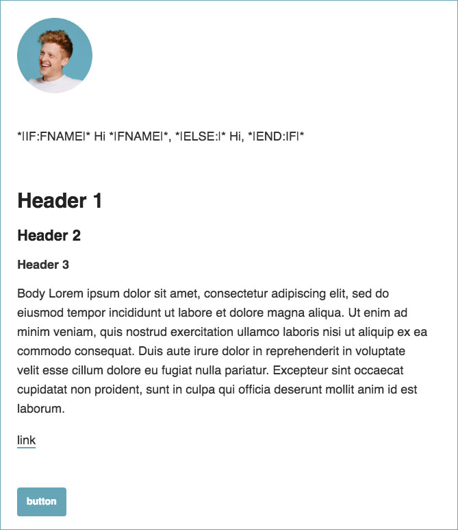

# My really simple mailchimp template

Most of the mailchimp templates are too... newslettery, but some basic styling is kinda nice. I'm using this for my personal site [jonnyburch.com](http://jonnyburch.com) as well as all things [Progression](http://progressionapp.com).

Full Preview [here](https://www.dropbox.com/s/0jdzgr9b53q01aa/Screenshot%202019-03-26%2014.44.44.png?dl=0).

**Have at it!**

### Instructions
1. Copy the uninlined version into a new mailchimp template
2. Tweak until happy (remember to test on desktop and mobile at least)
3. Inline using [the mailchimp inliner (or something else)](https://templates.mailchimp.com/resources/inline-css/)
4. Paste the inlined version back into the editor and save.
